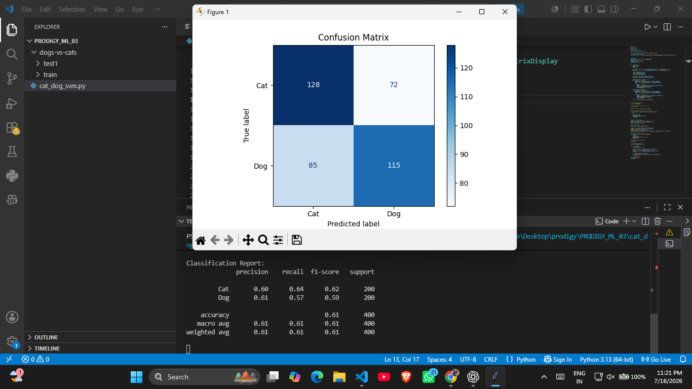

# 🐱🐶 Cat vs Dog Image Classification using SVM

## 📌 Project Overview

This project is part of my Machine Learning Internship at Prodigy InfoTech.

The objective is to classify images as either **Cat** or **Dog** using a **Support Vector Machine (SVM)** classifier.

---

## 📂 Dataset

- Dataset: Kaggle Dogs vs Cats
- Images were resized to **64×64 pixels**
- Converted to **grayscale**
- Normalized before training

---

## 🛠️ Technologies Used

- Python
- NumPy
- OpenCV
- Matplotlib
- Scikit-learn

---

## ⚙️ Workflow

1. Load images
2. Resize images to 64×64
3. Convert to grayscale
4. Flatten image pixels
5. Normalize data
6. Train SVM classifier
7. Predict test images
8. Evaluate model performance

---

## 📊 Results

- Model: Support Vector Machine (RBF Kernel)
- Accuracy: **61%**

---

## 📷 Output

### Confusion Matrix



### Actual vs Predicted


---

## 🚀 How to Run

```bash
pip install -r requirements.txt
python cat_dog_svm.py
```

---

## 📁 Project Structure

```
PRODIGY_ML_03
│── cat_dog_svm.py
│── requirements.txt
│── .gitignore
└── Output_images
    ├── cat_dog_confusion_matrix.png
    └── actual vs predicted output.png
```

---

## 👨‍💻 Author

**Pravardhan Tripathi**
